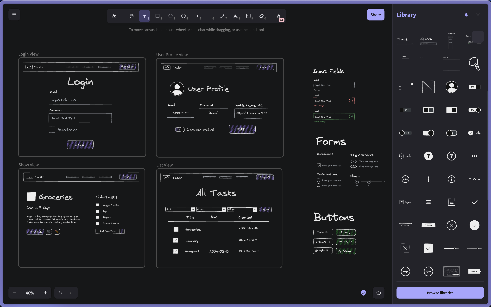
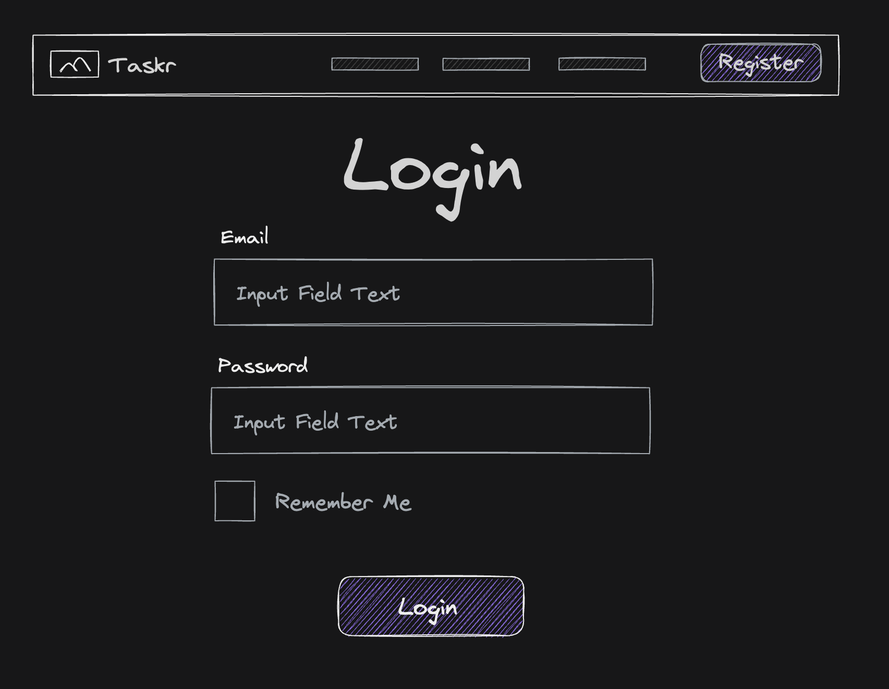
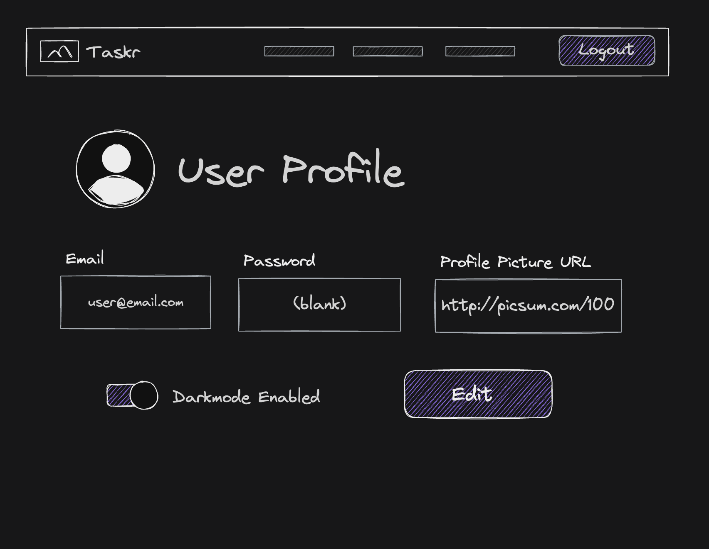
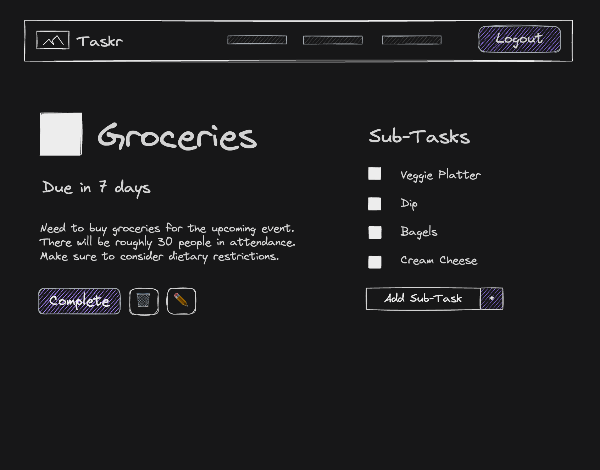

# MyChef
 
By [Elnara Kanybek](https://github.com/ElnaraKanybek) and [Christel Edee](https://github.com/ChristelEdee)
 
This project was developed for the Web Programming 3 course at John Abbott College.
 
Go to demo: [Webpage Demo](https://github.com/ElnaraKanybek/mychef-app#%EF%B8%8Fwebpage-demonstration) (click here)
 
## 🗺️Overview
 
* [Core Functionality](https://github.com/ElnaraKanybek/mychef-app#core-functionality)
* [Requirements](https://github.com/ElnaraKanybek/mychef-app#requirements)
* [Entity Relationships](https://github.com/ElnaraKanybek/mychef-app#%EF%B8%8Fentity-relationships)
* [API Routes](https://github.com/ElnaraKanybek/mychef-app#api-routes)
* [Webpage Demo](https://github.com/ElnaraKanybek/mychef-app#%EF%B8%8Fwebpage-demonstration)
* [Tech Stack](https://github.com/ElnaraKanybek/mychef-app#%EF%B8%8Ftech-stack)
* [Project Structure](https://github.com/ElnaraKanybek/mychef-app#project-structure)
* [Getting Started](https://github.com/ElnaraKanybek/mychef-app#getting-started)
## Core Functionality
 
**Browsing Recipes:** Users can browse all posted recipes, sortable and filterable by category. Each recipe row shows the recipe name, creator username, and category, with a Save button to add it to the user's Saved Recipes list.
 
**Creating Recipes:** Users can create their own recipes with a name, optional picture link, preparation time (in minutes), servings, and category. They can also add ingredients and preparation steps directly in the creation form.
 
**Recipe Step & Ingredient Management:** For each recipe, users break down preparation into numbered steps and list out ingredients separately.
 
**Saved Recipes:** Users can save recipes created by others to their personal Saved Recipes list, which shows the recipe name, date added, and category.
 
**My Recipes:** Each user has a personal recipe list showing all recipes they have created, with the creation date and category displayed. From here they can create new recipes.
 
**Home Page / Dashboard:** After logging in, users are greeted by name and can see a trending recipes list for the week, as well as a shortcut to browse all recipes.
 
---
 
## Requirements
 
### Recipe Stories
 
- As a user, I can browse all recipes and sort or filter them by category so I can find something that fits my needs.
- As a user, I want to create a recipe by providing a name, optional picture, preparation time, servings, category, ingredients, and steps.
- As a user, I can save a recipe from the browse page so it appears in my Saved Recipes list.
- As a user, I can view my Saved Recipes list to see all recipes I have saved, sorted and filtered by category or date added.
- As a user, I can view My Recipes list to see all recipes I have personally created, sorted and filtered by category or creation date.
- As a user, I want to delete a recipe I have created if I no longer wish to share it (only recipes I created, not someone else's).
- As a user, I want to be able to remove a recipe from my Saved Recipes list if I no longer want it saved.
- As a user, I want to edit a recipe I created so I can update its details, ingredients, or steps.
### Step & Ingredient Stories
 
- As a user, I want to add preparation steps to my recipe so others know how to make it.
- As a user, I want to add ingredients to my recipe so others know what they need.
- As a user, I want to delete steps and ingredients in a recipe I created.
### User Management Stories
 
- As a user, I want to register for an account by providing my first name, username, and password so I can start using the app.
- As a user, I want to log in with my username and password to access my recipes and saved list.
- As a user, I want to log out of my account to securely end my session.
- As a user, I want to be greeted by my first name on the home page so the experience feels personalized.
- As an admin, I can view a list of all registered users and their details.
- As an admin, I can delete any user account so I can moderate the platform.
- As an admin, I can delete any recipe regardless of who created it.
- As an admin, I cannot delete my own admin account.
### Home Page Stories
 
- As a user, I want to see a list of trending recipes this week on my home page so I can discover popular content.
- As a user, I want a shortcut on the home page to browse all recipes so I can quickly explore the community's recipes.
---
 
## 🗺️Entity Relationships
 

 
- **User** — has many created Recipes, has many Saved Recipe entries; has a `role` (enum: `'user'` | `'admin'`, default: `'user'`)
- **Recipe** — belongs to a User (creator), has many Steps, has many Ingredients, belongs to a Category
- **Step** — belongs to a Recipe, has an order index
- **Ingredient** — belongs to a Recipe
- **Saved Recipe** — join table between User and Recipe
---
 
## API Routes
 
### Authentication
 
| Request        | Action                            | Response       | Description                                            |
| -------------- | --------------------------------- | -------------- | ------------------------------------------------------ |
| GET /login     | SessionController::newSession     | 200 LoginView  | Display the login page                                 |
| POST /login    | SessionController::createSession  | 302 /home      | Log in and redirect to home; stores role in session    |
| DELETE /logout | SessionController::destroySession | 302 /login     | Log out and redirect to login                          |
| GET /signup    | UserController::newUser           | 200 SignUpView | Display the sign up page                               |
| POST /signup   | UserController::createUser        | 302 /home      | Register and redirect to home; role defaults to 'user' |
 
### Recipe Management
 
| Request                   | Action                          | Response             | Description                           |
| ------------------------- | -------------------------------- | -------------------- | ------------------------------------- |
| GET /recipes              | RecipeController::getAllRecipes | 200 RecipeListView   | Browse and filter all recipes         |
| POST /recipes             | RecipeController::createRecipe  | 201 /recipes/:id     | Create a new recipe                   |
| GET /recipes/:recipeId    | RecipeController::getRecipe     | 200 RecipeDetailView | View a specific recipe                |
| PUT /recipes/:recipeId    | RecipeController::updateRecipe  | 200 RecipeDetailView | Edit a recipe (owner only)            |
| PUT /recipes/:recipeId    | RecipeController::updateRecipe  | 403 /recipes/:id     | Forbidden if not the recipe's creator |
| DELETE /recipes/:recipeId | RecipeController::deleteRecipe  | 204 /recipes         | Delete a recipe (owner only)          |
 
### Step & Ingredient Management
 
| Request                                             | Action                                 | Response               | Description                   |
| --------------------------------------------------- | --------------------------------------- | ----------------------- | ------------------------------ |
| POST /recipes/:recipeId/steps                       | StepController::createStep             | 201 /recipes/:recipeId | Add a step to a recipe        |
| PUT /recipes/:recipeId/steps/:stepId                | StepController::updateStep             | 200 RecipeDetailView   | Edit a specific step          |
| DELETE /recipes/:recipeId/steps/:stepId             | StepController::deleteStep             | 204 /recipes/:recipeId | Delete a step                 |
| POST /recipes/:recipeId/ingredients                 | IngredientController::createIngredient | 201 /recipes/:recipeId | Add an ingredient to a recipe |
| DELETE /recipes/:recipeId/ingredients/:ingredientId | IngredientController::deleteIngredient | 204 /recipes/:recipeId | Delete an ingredient          |
 
### Saved Recipes
 
| Request                               | Action                        | Response                 | Description                         |
| -------------------------------------- | ------------------------------ | ------------------------- | ------------------------------------ |
| GET /users/:userId/saved              | SavedController::getSaved     | 200 SavedRecipesView     | View all saved recipes              |
| POST /users/:userId/saved             | SavedController::saveRecipe   | 201 /users/:userId/saved | Save a recipe to the list           |
| DELETE /users/:userId/saved/:recipeId | SavedController::unsaveRecipe | 204 /users/:userId/saved | Remove a recipe from the saved list |
 
### My Recipes
 
| Request                    | Action                             | Response          | Description                          |
| --------------------------- | ------------------------------------ | ------------------- | ------------------------------------- |
| GET /users/:userId/recipes | UserRecipeController::getMyRecipes | 200 MyRecipesView | View all recipes created by the user |
 
### Admin Management
 
| Request                         | Action                         | Response             | Description                                |
| --------------------------------- | -------------------------------- | ----------------------- | -------------------------------------------- |
| GET /admin/users                | AdminController::getAllUsers   | 200 AdminUsersView   | View all registered users                  |
| DELETE /admin/users/:userId     | AdminController::deleteUser    | 204 /admin/users     | Delete a user and all their data           |
| GET /admin/recipes              | AdminController::getAllRecipes | 200 AdminRecipesView | View all recipes with management controls  |
| DELETE /admin/recipes/:recipeId | AdminController::deleteRecipe  | 204 /admin/recipes   | Delete any recipe regardless of creator    |
 
### Middleware
 
| Middleware   | Checks                              | Applied To                                    |
| ------------ | ------------------------------------ | ---------------------------------------------- |
| requireAuth  | session.userId exists               | All protected routes                          |
| requireOwner | resource.userId === session.userId  | Edit / delete own recipes, steps, ingredients |
| requireAdmin | session.role === 'admin'            | All /admin/\* routes                          |
 
---
 
## ✨Webpage Demonstration
 
**Log In:**
 

 
**Home Page:**
 

 
**Browsing All Recipes:**
 

 
**Recipe Detail View:**
 

 
---
 
## 🛠️Tech Stack
 
**Client**
 
* React 19 (with React Router 6 for client-side routing)
* TypeScript
* Vite
* react-datepicker
**Server**
 
* Node.js + TypeScript
* Custom HTTP server, Router, Request, and Response classes (no external web framework)
* [postgres](https://github.com/porsager/postgres) for database access
* Session-based authentication with custom `SessionManager`, `Session`, and `Cookie` classes
* Role-based middleware (`requireAuth`, `requireOwner`, `requireAdmin`)
## Project Structure
 
```
src/
├── auth/
│   ├── Cookie.ts
│   ├── middleware.ts
│   ├── Session.ts
│   └── SessionManager.ts
├── controllers/
│   ├── AdminController.ts
│   ├── AllRecipesController.ts
│   ├── Ingredientcontroller.ts
│   ├── SavedRecipecontroller.ts
│   ├── Stepcontroller.ts
│   └── UserController.ts
├── models/
│   ├── Ingredient.ts
│   ├── Recipe.ts
│   ├── SavedRecipe.ts
│   ├── Step.ts
│   └── User.ts
├── router/
│   ├── Request.ts
│   ├── Response.ts
│   └── Router.ts
├── Server.ts
└── utils.ts
 
client/
└── src/
    ├── components/
    │   ├── AllRecipes.tsx
    │   ├── CreateRecipe.tsx
    │   ├── FetchRecipeById.tsx
    │   ├── FetchRecipesByName.tsx
    │   ├── Footer.tsx
    │   ├── Home.tsx
    │   ├── Login.tsx
    │   ├── MyRecipes.tsx
    │   ├── NavBar.tsx
    │   ├── RecipeListView.tsx
    │   ├── RecipeSearch.tsx
    │   ├── RecipeSearchById.tsx
    │   ├── RecipeView.tsx
    │   ├── SavedRecipes.tsx
    │   ├── SignIn.tsx
    │   └── type.ts
    ├── App.tsx
    ├── App.css
    └── main.tsx
 
app.ts
url.ts
 
images/
├── collab.png
├── excalidraw.png
├── login-view.png
├── profile-view.png
└── show-view.png
```
 
## Getting Started
 
1. Clone the repo:
```bash
   git clone https://github.com/ElnaraKanybek/mychef-app.git
   cd mychef-app
```
2. Install dependencies for both the server and client:
```bash
   npm install
   cd client && npm install
```
3. Set up a local Postgres database named `TodoDB` (or update `app.ts` to match your own database name), and configure a `.env` file with your `HOST` and `PORT` if you want to override the defaults.
4. Start the server:
```bash
   npx tsx app.ts
```
5. Start the client:
```bash
   cd client
   npm run dev
```
6. Open the client at `http://localhost:5173` in your browser.
